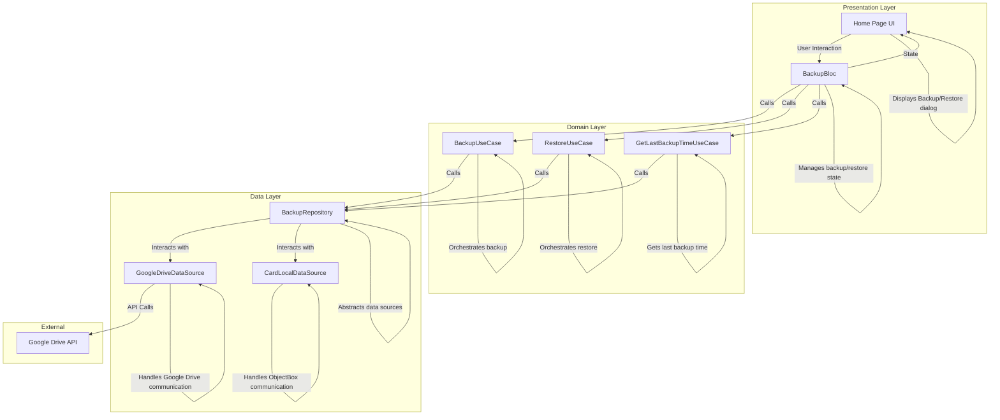
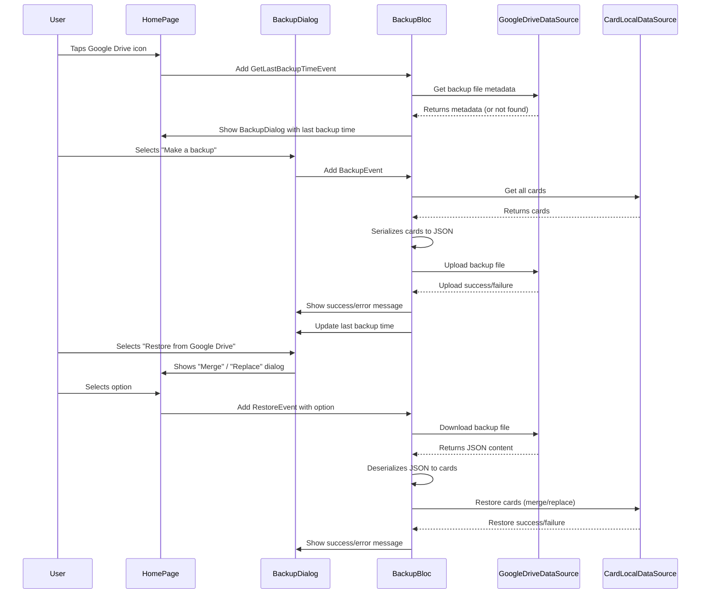

# Google Drive Backup and Restore Feature

## Overview

This document outlines the design for a new feature in the Card Hive application that allows users to back up and restore their loyalty card data to and from Google Drive. This will provide users with a way to safeguard their data and transfer it between devices. This design also includes displaying the last backup time to the user.

## Detailed Analysis

### Problem

Currently, all user card data is stored locally in an ObjectBox database on the device. This means that if the user uninstalls the application, loses their device, or has a device malfunction, all their stored card information is permanently lost. There is no mechanism for data recovery or synchronization between devices. Users also have no visibility into when their last backup was performed.

### Goal

The goal is to implement a manual backup and restore feature using Google Drive. This will give users control over their data and a simple way to protect it. The user will also be able to see when their last backup was performed.

### Requirements

Based on our discussion, the feature must meet the following requirements:

*   **Manual Trigger:** The backup and restore processes will be initiated manually by the user from a dialog.
*   **UI Location:** A button to access the feature will be located in the app bar of the home page. Tapping this button will open a dialog.
*   **Dialog Content:** The dialog will contain:
    *   A "Make a backup" button.
    *   A "Restore from Google Drive" button.
    *   A display of the last backup time, retrieved from Google Drive. If no backup exists, it will indicate that.
*   **Restore Options:** When restoring data, the user will be presented with an option to either:
    *   **Merge:** Combine the restored cards with the existing local cards (default option).
    *   **Replace:** Delete all local cards before adding the restored cards.
*   **File Naming:** The backup file will be named `card_hive_backup.json` in the user's Google Drive.
*   **Offline Handling:** If the user is offline and attempts to use the feature, the app will display an error message.
*   **Google Account:** If the user does not have a Google account configured on their device, the app will prompt them to add one or inform them that an account is required.

## Alternatives Considered

### 1. Other Cloud Providers

*   **Description:** Instead of Google Drive, we could have used other cloud storage providers like Dropbox, OneDrive, or iCloud.
*   **Reason for Not Choosing:** Google Drive was chosen because it is a popular and widely used service with good cross-platform support. The `googleapis` package for Flutter provides a robust way to interact with the Google Drive API. The user also expressed a preference for Google Drive.

### 2. Automatic Backups

*   **Description:** The app could automatically back up the user's data periodically in the background.
*   **Reason for Not Choosing:** While automatic backups are convenient, they add complexity in terms of scheduling, handling background processes, and managing battery consumption. The user explicitly requested a manual process, which gives them more control and transparency over their data.

### 3. Different Data Formats

*   **Description:** We could have used a different format for the backup file, such as CSV or a binary format.
*   **Reason for Not Choosing:** JSON was chosen because it is human-readable, easy to parse in Dart using the `dart:convert` library, and flexible enough to handle the structure of the card data.

## Detailed Design

The implementation will follow the existing Clean Architecture pattern of the project.

### 1. Architecture

We will introduce new components in the `data`, `domain`, and `presentation` layers to handle the backup and restore logic.

*   **`BackupBloc` (`presentation`):** Manages the state of the backup and restore UI and handles user events.
*   **`BackupUseCase` / `RestoreUseCase` / `GetLastBackupTimeUseCase` (`domain`):** Contain the business logic for backing up, restoring, and getting the last backup time.
*   **`BackupRepository` (`domain`):** An abstract interface for the backup and restore data operations.
*   **`BackupRepositoryImpl` (`data`):** The implementation of the `BackupRepository`, which will coordinate between the `GoogleDriveDataSource` and the `CardLocalDataSource` (ObjectBox).
*   **`GoogleDriveDataSource` (`data`):** A new data source responsible for all communication with the Google Drive API.

### 2. Authentication

*   We will use the `google_sign_in` package to handle user authentication.
*   When the user initiates a backup or restore, the app will request the following scope: `https://www.googleapis.com/auth/drive.file`. This scope grants per-file access to files created or opened by the app, which is the most secure and recommended approach.
*   The authentication flow will be as follows:
    1.  The user taps the backup/restore button.
    2.  The app checks if the user is already signed in.
    3.  If not, the `google_sign_in` flow is initiated.
    4.  If the user does not have a Google account on their device, they will be guided by the system to add one.
    5.  Once authenticated, the app will obtain an authenticated HTTP client to be used for Google Drive API requests.

### 3. Google Drive API Interaction

*   We will use the `googleapis` package, specifically `drive.v3.DriveApi`.
*   **`GoogleDriveDataSource`** will encapsulate all API interactions.
*   **Backup Flow:**
    1.  Check if `card_hive_backup.json` already exists in the user's Google Drive (in the app's private space).
    2.  If it exists, get its file ID to update it.
    3.  If it doesn't exist, create a new file.
    4.  Use the `files.create` or `files.update` method with `uploadMedia` to upload the JSON content.
*   **Restore Flow:**
    1.  Search for `card_hive_backup.json` in the user's Google Drive.
    2.  If found, get the file ID.
    3.  Use the `files.get` method with the `alt=media` parameter to download the file content.
    4.  If not found, show an error to the user.
*   **Get Last Backup Time Flow:**
    1.  Search for `card_hive_backup.json` in the user's Google Drive.
    2.  If found, get the file's `modifiedTime` metadata.
    3.  If not found, return a null or equivalent value to indicate no backup exists.

### 4. Data Handling

*   **Serialization:**
    *   Query all `Card` objects from the ObjectBox database.
    *   For each `Card` object, create a `Map<String, dynamic>` representation.
    *   Use `jsonEncode` from `dart:convert` to serialize the list of maps into a JSON string.
*   **Deserialization:**
    *   Use `jsonDecode` to parse the downloaded JSON string into a `List<dynamic>`.
    *   Iterate through the list and create `Card` objects from the map data.
*   **Restore Logic:**
    *   **Merge:** For each restored card, check if a card with the same ID already exists in the local database. If not, add it.
    *   **Replace:** Clear the entire ObjectBox `Card` box before inserting the restored cards.

### 5. UI/UX Flow

### 6. State Management

The `BackupBloc` will manage the following states:

*   `BackupInitial`: The initial state.
*   `BackupInProgress`: When a backup or restore operation is in progress. The UI will show a loading indicator.
*   `BackupSuccess`: When an operation completes successfully. The UI will show a success message.
*   `BackupFailure`: When an operation fails. The UI will show an error message with the reason for the failure.
*   `BackupInfoReady`: When the last backup time is available, this state will hold the information to be displayed in the dialog.
*   `RestoreOptionRequired`: When the user initiates a restore, this state will trigger the UI to show the merge/replace dialog.

## Summary

The proposed design introduces a robust and secure way for users to back up and restore their data using Google Drive. By following the existing Clean Architecture pattern, the new feature will be well-integrated, maintainable, and testable. The use of `google_sign_in` and `googleapis` packages will ensure a standard and reliable integration with Google's services. The addition of the last backup time provides users with more visibility and confidence in their data protection.

## References

*   [Flutter Google Drive Integration Tutorial](https://medium.com/@chetan8827/google-drive-integration-in-flutter-9855c6831372)
*   [google_sign_in package](https://pub.dev/packages/google_sign_in)
*   [googleapis package](https://pub.dev/packages/googleapis)
*   [Google Drive API v3 Documentation](https://developers.google.com/drive/api/v3/reference)